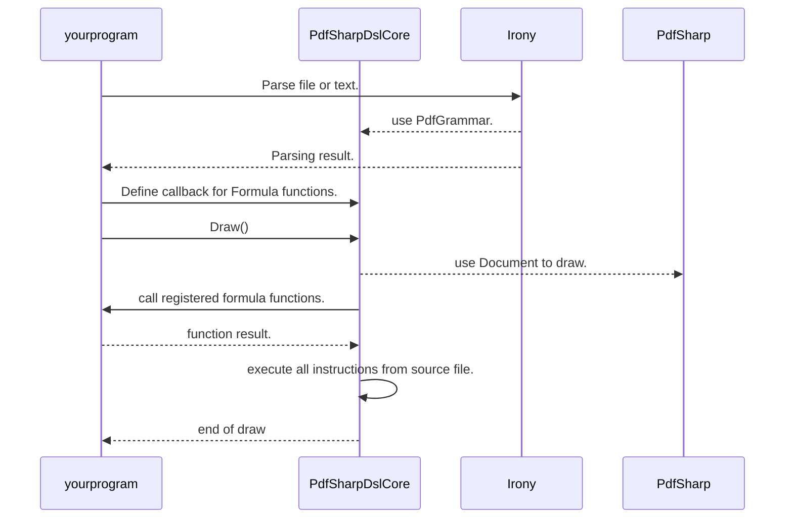

# PdfSharpDslCore

[](https://www.nuget.org/packages/PdfSharpDslCore/)
[](https://github.com/pgourlain/bnf_and_pdf/actions/workflows/build.yml)

This is a sample library that use [Irony.Net](https://github.com/IronyProject/Irony) to define a grammar to print PDF using [PdfSharpCore](https://github.com/ststeiger/PdfSharpCore/)


# Example

```csharp
var parser = new Irony.Parsing.Parser(new PdfGrammar());

var parsingResult = parser.Parse(File.ReadAllText("pdfsharp.txt"));

if (parsingResult.HasErrors())
{
    //show Error
    foreach (var error in parsingResult.ParserMessages)
    {
        Console.Write(error.Location.ToString());
        Console.Write("=>");
        Console.WriteLine(error);
    }
}
else
{
    //PdfSharpCore cclasses
    var document = new PdfDocument();
    //draw parsing result
    using var drawer = new PdfDocumentDrawer(document);
    new PdfDrawerVisitor().Draw(drawer, parsingResult);
    document.Save("helloworld.pdf");
}
```

or download source code, then goto PdfSharpDslConsole and run it
```shell
dotnet run 
```
# Architecture




# Language specification

It's a list of drawing "orders" follow by ';' 

All coordinates are specified in 'points'

- 1 inch = 72.0 points
- 1 millimeter = 72.0 points / 25.4 ~=> 2.84 points
- 1 centimeter = 72.0 points / 2.54 ~=> 28.34 points

## Formula feature

- a formula result can be string or double
- aritmetic/boolean operations are : +, -, /, *, %, >, <, >=, <=,==, <>, and, or
- variable reference : $VarName, and must be declared before with SET VAR VarName=Formula
- a formula is a string or a boudle value
- Boolean comparison are resolved using double, 0.0 => false, other value => true
- string comparison accept only <>, == operators

```text
SET VAR A=2
SET VAR B=3
SET VAR CSquare=$A*$A+$B*$B
```

Formula can be used in :
- each number in [PointLocation, RectLocation, Width, FontSize, startAngle, sweepAngle]
- in UserDefineFunction (UDF)
- in IF condition

Formula support also customFunction
1)
```CSharp
var visitor = ew PdfDrawerVisitor();
visitor.RegisterFormulaFunction("SUM", (args) => args.Sum(x => Convert.ToDouble(x)));
```

2) then use it in formulas
```text
SET VAR CSquare=Sum($A*$A, $B*$B+Sum(1,2,3))
```

## Color and Brush

```text
# SET PEN Color Width [Style]
SET PEN black 1;
SET PEN black 1 solid;
SET PEN black 1 dot;
SET PEN black 1 dashdot;
SET PEN black 1 dashdotdot;

**Width** is one of
- number
- Formula


# SET BRUSH Color
SET BRUSH black;

**Color** is one of
- NamedColor : [color list](./README.md#named-color-list)
- HexColor : 0xRGB 
    - sample: 0xFFEEBB

# SET FONT FontName FontSize [FontStyle]
SET FONT Name="Arial" Size=20 bold;
```

**FontName**  is one of 
- string
- Formula

**[FontStyle]** is one of
- **regular** (if not specified)
- bold
- italic
- bolditalic
- underline
- strikeout


## Title

Draw text with a specified margin from top or bottom if negative.
```text
# TITLE HAlign=HorizontalAlignment Text="text to draw" 
TITLE HAlign=hcenter Text="TITLE TEST";

# TITLE [MarginTop] HorizontalAlignment "text to draw" 
TITLE Margin=50 HAlign=hcenter Text="My title with margin 50";

```  

**HorizontalAlignment** : left, hcenter, right
**[MarginTop]** : margin from top if positive, margin from bottom if negative


## Ellipse, Rectangle, Line

```text
# ELLIPSE RectLocation
ELLIPSE 5, 5, -5, -5;
# RECT RectLocation
RECT 5, 5, -5, -5;

SET BRUSH orange;
# FILLRECT RectLocation
FILLRECT 250, 100, 50,50;

SET BRUSH green;
# FILLELLIPSE RectLocation
FILLELLIPSE 250, 200, 50,50;

# LINE RectLocation
LINE 100,100, 200, 100;
```
here Width and Height of RectLocation is X1 and Y1

LINE, ELLIPSE, RECT use PEN (outline) 

FILLRECT, FILLELLIPSE use PEN (outline) and BRUSH (fill)

**RectLocation** is one of
- positive number : number of point from left
- negative number : number of point from right
- formula : supports only "+ - * / ( )"


## Pie, FillPie 

```text
# PIE RectLocation startAngle sweepAngle
PIE 10,10,120,120 Start=0 Angle=90;
FILLPIE 10,10,120,120 Start=0 Angle=90;
```


## Polygon, FillPolygon

```text
# POLYGON PointLocation PointLocation PointLocation [PointLocation PointLocation PointLocation ...]
POLYGON 300,300, 350,320, 330,350, 240,240;

FILLPOLYGON 100,100, 150,120, 130,150, 240,40;
```


## MoveTo, LineTo

TODO

## New page

```text
# NEWPAGE [PageSize] [PageOrientation];
NEWPAGE ;
NEWPAGE A4 portrait;
```

**[PageSize]** is one of 
- A0, A1, A2, A3, A4, A5, A6, B0, B1, B2, B3, B4, B5, Crown, Demy, DoubleDemy, Elephant, Executive, Folio, Foolscap, GovernmentLetter, LargePost, Ledger, 
Legal, Letter, Medium, Post, QuadDemy, Quarto, RA0, RA1, RA2, RA3, RA4, RA5, Royal, Size10x14, Statement, STMT, Tabloid, Undefined

**[PageSize]** is one of 
- portrait, landscape

## Image

```text
# IMAGE PointLocation Source=ImageFilePath
IMAGE 100,100 Source="./imageTest.jpg";

# IMAGE PointLocation Data=Base64 encoded image
IMAGE 100,100 Source="data:image/...";

# IMAGE PointLocation,width,height width_height_unit ImageFilePath
IMAGE 320,100,34,34 point Source="./imageTest.jpg";

# IMAGE PointLocation,width,height width_height_unit [cropping] ImageFilePath
IMAGE 100,320,50,50 pixel crop Source="C:\\Samples\\imageTest.jpg";
IMAGE 100,320,50,50 pixel crop Source="C:/Samples/imageTest.jpg";


```

**ImageFilePath** : path can be relative or absolute

**width_height_unit** : 'point' or 'pixel'
- when specified image is scale to provided rectangle

**[cropping]** : don't scale but crop image from provided rectangle


## Text

```text
# LINETEXT PointOrRect [hAlign] [vAlign] [Orientation] Text="text"
LINETEXT 42,100 Text="Horizontal text"

LINETEXT 42,100 vertical Text="Horizontal text"
LINETEXT 42,100 left bottom vertical Text="Horizontal text";
```

**[hAlign]** is one of
- left, right, hcenter

**[vAlign]** is one of
- top, bottom, vcenter

**[Orientation]** is one of
- horizontal, vertical


```text
# TEXT PointOrRect [MaxWidth=formula] Text="text"
TEXT 42,100 Text="Horizontal text"

TEXT 42,100 MaxWidth=50 Text="Horizontal text"
```
- specify MaxWidth to wrap text on multi-lines
- this 'TEXT' cannot be align

## ROWTEMPLATE

```text
# ROWTEMPLATE Count=formula Y=formula [BorderSize=formula]
# ENDROWTEMPLATE

ROWTEMPLATE Count=3 Y=300 BorderSize=5
    # top line under border
	LINE 0,0,$PAGEWIDTH-20, 0;

	LINE 0,0,50, 50;
    # bottom line under border
	LINE 0,50,$PAGEWIDTH-20, 50;
ENDROWTEMPLATE
# rect include borders
RECT 0,300, $PAGEWIDTH-20, $LASTTEMPLATEHEIGHT 
```

This statement is like a table, but only for row
- foreach loop the start point is 0,0
- you can access to variable '$ROWINDEX' inside template
- after template you can access to '$LASTTEMPLATEHEIGHT' to know the height(in point) of the previous template

**[BorderSize]** 
- is to add space between each loop
- a space is added on top and at bottom when specified

TODO

## User Define Function

### define function

```text
UDF MyUdf()
LINETEXT 100,100 Text="Horizontal text"
ENDUDF

UDF MyUdf1(X,Y)
LINETEXT $X,$Y Text="Horizontal text"
ENDUDF
```

### Call an User Define Function

```text
CALL MyUdf();
# udf with parameters
CALL MyUdf1(100,100);
```
each parameter can be a Formula

## Debugging

```text
DEBUGOPTIONS Option1 [, Option2];
```

Available options
- DEBUG_TEXT : shows red rect around texts
- DEBUG_ROWTEMPLATE : shows red rect around each iteration and index number of each at topleft rectangle
  - text format is "{level}.{index}", where level is > 0 when ROWTEMPLATE is part of another ROWTEMPALTE 


## Named Color list

aliceblue
antiquewhite
aqua
aquamarine
azure
beige
bisque
black
blanchedalmond
blue
blueviolet
brown
burlywood
cadetblue
chartreuse
chocolate
coral
cornflowerblue
cornsilk
crimson
cyan
darkblue
darkcyan
darkgoldenrod
darkgray
darkgreen
darkkhaki
darkmagenta
darkolivegreen
darkorange
darkorchid
darkred
darksalmon
darkseagreen
darkslateblue
darkslategray
darkturquoise
darkviolet
deeppink
deepskyblue
dimgray
dodgerblue
firebrick
floralwhite
forestgreen
fuchsia
gainsboro
ghostwhite
gold
goldenrod
gray
green
greenyellow
honeydew
hotpink
indianred
indigo
ivory
khaki
lavender
lavenderblush
lawngreen
lemonchiffon
lightblue
lightcoral
lightcyan
lightgoldenrodyellow
lightgray
lightgreen
lightpink
lightsalmon
lightseagreen
lightskyblue
lightslategray
lightsteelblue
lightyellow
lime
limegreen
linen
magenta
maroon
mediumaquamarine
mediumblue
mediumorchid
mediumpurple
mediumseagreen
mediumslateblue
mediumspringgreen
mediumturquoise
mediumvioletred
midnightblue
mintcream
mistyrose
moccasin
navajowhite
navy
oldlace
olive
olivedrab
orange
orangered
orchid
palegoldenrod
palegreen
paleturquoise
palevioletred
papayawhip
peachpuff
peru
pink
plum
powderblue
purple
red
rosybrown
royalblue
saddlebrown
salmon
sandybrown
seagreen
seashell
sienna
silver
skyblue
slateblue
slategray
snow
springgreen
steelblue
tan
teal
thistle
tomato
transparent
turquoise
violet
wheat
white
whitesmoke
yellow
yellowgreen

## Dependencies :

this package is build on top of 

- PDF :
	- pdfSharpCore : https://github.com/ststeiger/PdfSharpCore
	
- Parsers : 
	- Irony : https://github.com/IronyProject/Irony

## Source Generator

You can generate C# from PDF DSL, in order to have "hard coded" PDF.
You can generate C# code of UDF (user define function)
- is not yet available
