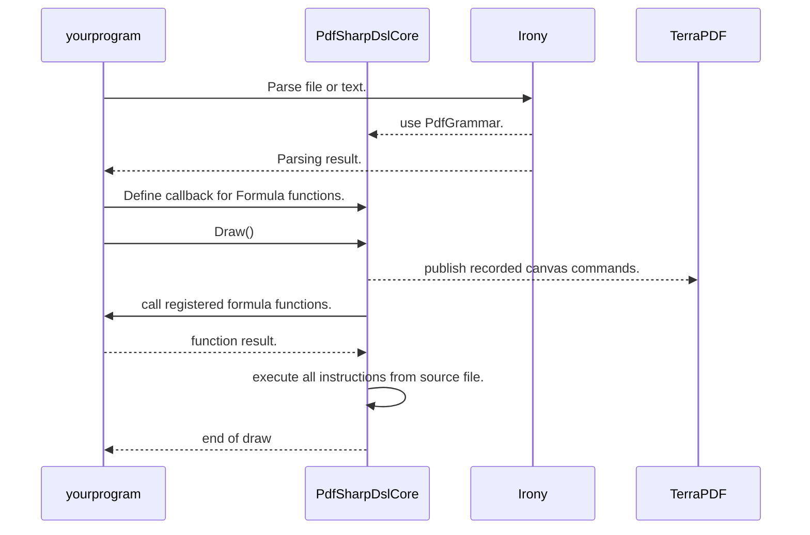

# PdfSharpDslCore

[](https://www.nuget.org/packages/PdfSharpDslCore/)
[](https://github.com/pgourlain/bnf_and_pdf/actions/workflows/build.yml)

This is a sample library that uses [Irony.Net](https://github.com/IronyProject/Irony) to define a grammar and [TerraPDF](https://www.nuget.org/packages/TerraPDF) to print PDF.

## Current support

- `PdfSharpDslCore` multi-targets `net8.0` and `net10.0`; `PdfSharpDsl.Language` and `PdfSharpDslCore.Generator` target `netstandard2.0` because they are loaded by the compiler.
- `PdfSharpDslConsole` and the test project target `net10.0`.
- The repository is pinned to SDK `10.0.400` in `global.json`.
- Version, licence, package metadata and every NuGet version are centralized in [`_build/`](_build/): `Version.props` (the single product version), `Common.props` (shared metadata and target-framework aliases) and `Packages.props` (central package management). The `Directory.Build.props`, `Directory.Build.targets` and `Directory.Packages.props` files at the repository root only import these. Change a version or a target framework there, never in an individual `.csproj`.
- The generator package includes its analyzer dependencies and supports clean NuGet consumer builds.

Run the full test and core coverage gate with:

```powershell
powershell -NoProfile -File .\scripts\coverage.ps1
```

The gate requires at least 90% core line coverage. See [tasks.md](tasks.md) for the migration tracker and verified results.


# Example

```csharp
var parser = new Irony.Parsing.Parser(new PdfGrammar());

var parsingResult = parser.Parse(File.ReadAllText("pdfsharp.ipdf"));

if (parsingResult.HasErrors())
{
    //show Error
    foreach (var error in parsingResult.ParserMessages)
    {
        Console.Write(error.Location.ToString());
        Console.Write("=>");
        Console.WriteLine(error);
    }
}
else
{
    using var drawer = new PdfDocumentDrawer();
    new PdfDrawerVisitor().Draw(drawer, parsingResult);
    drawer.PublishPdf("helloworld.pdf");
}
```

or download source code, then goto PdfSharpDslConsole and run it
```shell
dotnet run 
```
# Architecture



```mermaid
sequenceDiagram
    participant yourprogram
    participant PdfSharpDslCore
    participant Irony
    participant TerraPDF
    yourprogram->>Irony: Parse file or text.
    Irony -->> PdfSharpDslCore: use PdfGrammar.
    Irony-->>yourprogram: Parsing result.
    
    yourprogram->>PdfSharpDslCore: Define callback for Formula functions.
    yourprogram->>PdfSharpDslCore: Draw()
    PdfSharpDslCore -->>TerraPDF: publish recorded canvas commands.
    PdfSharpDslCore->>yourprogram: call registered formula functions.
    yourprogram-->>PdfSharpDslCore: function result.
    PdfSharpDslCore->>PdfSharpDslCore: execute all instructions from source file.
    PdfSharpDslCore-->>yourprogram: end of draw
```

# Language specification

It's a list of drawing "orders" follow by ';' 

All coordinates are specified in 'points'

- 1 inch = 72.0 points
- 1 millimeter = 72.0 points / 25.4 ~=> 2.84 points
- 1 centimeter = 72.0 points / 2.54 ~=> 28.34 points

## Formula features

- a formula result can be string or double
- aritmetic/boolean operations are : +, -, /, *, %, >, <, >=, <=,==, <>, and, or
- variable reference : $VarName, and must be declared before with SET VAR VarName=Formula
- a formula is a string or a boudle value
- Boolean comparison are resolved using double, 0.0 => false, other value => true
- string comparison accept only <>, == operators

```text
SET VAR A=2
SET VAR B=3
SET VAR CSquare=$A*$A+$B*$B
```

Formula can be used in :
- each number in [PointLocation, RectLocation, Width, FontSize, startAngle, sweepAngle]
- in UserDefineFunction (UDF)
- in IF condition

Formula support also customFunction

1) Register a formula function in your code
```CSharp
var visitor = new PdfDrawerVisitor();
visitor.RegisterFormulaFunction("SUM", (args) => args.Sum(x => Convert.ToDouble(x)));
```

2) then use it in formulas
```text
SET VAR CSquare=Sum($A*$A, $B*$B+Sum(1,2,3))
```

### Built-in functions

Available without registration. A function registered with `RegisterFormulaFunction` under the same name overrides it.

| Group | Functions |
|---|---|
| Math | `Min(a,b,…)`, `Max(a,b,…)`, `Sum(a,b,…)`, `Abs(x)`, `Round(x[,digits])`, `Floor(x)`, `Ceil(x)`, `Sqrt(x)`, `Pow(x,y)` |
| String | `Upper(s)`, `Lower(s)`, `Len(s)`, `Substr(s,start[,len])`, `Replace(s,a,b)`, `Trim(s)` |
| Format | `Format(value, fmt)`: .NET format string, invariant culture, e.g. `Format(1284.5,"N2")` → `1,284.50`, `Format(Now(),"yyyy-MM-dd")` |
| Date | `Now()`, `Today()`: return a `DateTime`. Only usable through `Format`; concatenating one with `+` falls back to `DateTime`'s default, culture-dependent `ToString()` |
| Logic | `Iif(cond, a, b)` |
| List | `Count(list)`: number of items of a [list](#lists) |

A wrong argument count raises a `PdfParserException` naming the function.

`TextWidth(text)` and `TextHeight(text[, maxWidth])` measure text in points using the current font (`SET FONT`), e.g. to size a box to its content:

```text
SET VAR W=TextWidth("Total");
FILLRECT 40,100,$W+20,20;
```

### System variables

Set by the engine, read like any other variable.

| Variable | Available | Value |
|---|---|---|
| $PAGEWIDTH | everywhere | current page width in points |
| $PAGEHEIGHT | everywhere | current page height in points |
| $PAGEINDEX | everywhere | 1-based index of the current page |
| $PAGECOUNT | everywhere (text only, see below) | total number of pages, resolved when the document is published |
| $ROWINDEX | inside ROWTEMPLATE (free or table) | 0-based index of the current iteration |
| $LASTTEMPLATEHEIGHT | after a ROWTEMPLATE | height in points of the last template, when it did not break the page |
| $CURSORY | inside FLOW | y where the next element of the flow starts |

See also the reserved UDF `__ONNEWPAGE` (called after each new page). It and the `MASTER` body can draw with their own font, brush and pen: the ones in use before the page was created are restored afterwards (variables they set stay set).

`$PAGECOUNT` is only known once every page has been recorded, so it only works inside `TITLE`/`LINETEXT` text, e.g. a footer set from `__ONNEWPAGE`:

```text
TITLE Margin=-18 Text=("page "+$PAGEINDEX+" / "+$PAGECOUNT);
```

It only supports string concatenation (`+`); using it in arithmetic or a comparison (`$PAGECOUNT-1`, `$PAGECOUNT>3`, …) raises a clear error, since its value does not exist yet while the script runs.

## Control flow

```text
# IF ... THEN ... [ELSE IF ... THEN ...]... [ELSE ...] ENDIF
IF $X > 10 THEN
    SET VAR SIZE="big";
ELSE IF $X > 5 THEN
    SET VAR SIZE="medium";
ELSE
    SET VAR SIZE="small";
ENDIF

# FOR var=from TO to [STEP n] DO ... ENDFOR  (bounds are inclusive)
FOR I=0 TO 10 STEP 5 DO ... ENDFOR      # 0, 5, 10
FOR I=10 TO 0 STEP -2 DO ... ENDFOR     # counts down

# WHILE condition DO ... ENDWHILE
SET VAR Y=100;
WHILE $Y < $PAGEHEIGHT-50 DO
    LINE 40,$Y,300,$Y;
    SET VAR Y=$Y+20;
ENDWHILE
```

- `ELSE IF` (with any whitespace between the words) continues the same `IF`: the whole chain has a single `ENDIF`, and conditions are only evaluated until one is true. **Breaking change:** `ELSE` followed by a nested `IF` used to need two `ENDIF`s; to nest an `IF` inside an `ELSE` now, put something (a statement or a `#` comment) between `ELSE` and `IF`.
- `STEP` is an integer formula, `1` by default. A negative step counts down; `STEP 0` raises a `PdfParserException`. A loop whose direction does not reach `to` (`FOR I=5 TO 1`) does not run.
- `WHILE` stops with a `PdfParserException` after 10 000 iterations, so a condition that never becomes false cannot hang the generation.
- Loop variables and variables set in a loop stay available after it.

## Lists

```text
SET VAR ITEMS=["a","b","c"];
SET VAR FIRST=$ITEMS[0];             # indexes start at 0
SET VAR N=Count($ITEMS);
SET VAR Y=100;
FOREACH ITEM IN $ITEMS DO
    LINETEXT 40,$Y Text=$ITEM;
    SET VAR Y=$Y+16;
ENDFOREACH
SET VAR M=[[1,2],[3,4]];
SET VAR X=$M[1][0];                  # 3
```

- A list literal is `[formula, formula, …]` (`[]` is an empty list); items can be any formula, including other lists.
- `$VAR[index]` reads an item; the index is a formula. It can be chained for lists of lists. It only applies to a variable (`Names()[0]` is not supported; store the result in a variable first). An index that is not a whole number inside the list raises a `PdfParserException` with the position.
- `FOREACH var IN formula DO … ENDFOREACH` visits the items in order; the formula must give a list.
- A formula function registered by the host can return any array or list (not a string): it works with `FOREACH`, `Count` and `$VAR[index]`.
- A list used in a text (`"items: "+$ITEMS`) is shown as `[a, b, c]`.

## Host data

The host gives the script structured data before drawing:

```csharp
var visitor = new PdfDrawerVisitor();
visitor.SetData("orders", orders);          // any IEnumerable of objects or dictionaries
visitor.SetData("REPORTTITLE", "Q3 report"); // or a plain value: a preset variable
visitor.Draw(drawer, tree);
```

```text
LINETEXT 40,40 Text=$REPORTTITLE;
SET VAR Y=80;
FOREACH O IN $orders DO
    LINETEXT 40,$Y Text=($O.customer+": "+Format($O.amount,"N2"));
    SET VAR Y=$Y+16;
ENDFOREACH
ROWTEMPLATE Count=Count($orders) Y=200
    LINETEXT 40,0 Text=$orders[$ROWINDEX].customer;
ENDROWTEMPLATE
```

- `$record.field` reads a field: from a dictionary by key, from any other object by public property or field (case-insensitive, an exact match wins). It chains with indexes: `$orders[0].customer`, `$order.parent.name`, `$o.tags[2]`; a list item can be a record.
- A missing field raises a `PdfParserException` with the position and, when a name is close, a "Did you mean" (or the list of available fields); a field of an empty value (`$o.parent.name` with no parent) raises one too.
- A dictionary is a record, not a list: `FOREACH` over one is an error. Any other `IEnumerable` except a string is a list, so `Count`, `FOREACH` and `$LIST[i]` work on it.
- Values keep their .NET type: a `DateTime` field goes through `Format($o.date,"yyyy-MM-dd")`, a `decimal` works in arithmetic.
- `SetData` names are case-sensitive, like variables. The values are copied into the variables at each `Draw`; the script can overwrite them with `SET VAR`.

## Named styles

```text
STYLE h1
    SET FONT Name="Arial" Size=20 bold;
    SET BRUSH darkblue;
ENDSTYLE
USE h1;
LINETEXT 40,60 Text="Title";
```

- A style is a list of `SET PEN`, `SET BRUSH`, `SET HBRUSH` and `SET FONT` statements (no `SET VAR`); `USE name;` replays them, and they stay set afterwards like any other `SET`.
- Styles are hoisted like UDFs: `USE` can come before the `STYLE` definition. `USE` of an unknown style raises a `PdfParserException` (with a "Did you mean" suggestion when a style has a similar name); defining the same style twice does too.

## INCLUDE

```text
INCLUDE "common.ipdf";
```

- The statements of the file replace the `INCLUDE` line, so a shared file can define `UDF`s, `STYLE`s, `MASTER`s and variables (`SET VAR`), and can also draw.
- Paths are relative to the file that contains the `INCLUDE` (so nested includes work from any folder). `INCLUDE` is only accepted at the top level of a file, not inside a block.
- A file is included **once** per document: a later `INCLUDE` of the same file is skipped. So every file can `INCLUDE` the shared files it needs (and still be drawn alone) without defining their UDFs twice.
- A missing file, a circular include (`a.ipdf -> b.ipdf -> a.ipdf`), a nesting deeper than 16 files or a syntax error in the included file raise a `PdfParserException`; the last one names the file and the line *in that file*. Run-time errors inside an included file (undefined variable, unknown function, list index…) say `at line 2, col 12 of file.ipdf`, including from a UDF or MASTER defined there.
- Relative `IMAGE Source=` paths are resolved from the folder of the file that contains the statement.
- The visitor resolves the main file's relative paths from its base directory (`new PdfDrawerVisitor(baseDirectory, logger)`, the current directory by default); the console uses the folder of the drawn file. It also works in the source generator. Since an included file is parsed when the document is drawn, the syntax of `INCLUDE`d files is not checked by the first `Parse` of the main file.
- `PdfSharpDslConsole/demo.ipdf` is only a list of `INCLUDE`s of `demo-common.ipdf` (shared UDFs, styles, master) and `demo-includes/NN-feature.ipdf`, one file per feature; each of them can be drawn alone, e.g. `dotnet run -- demo-includes/11-flow.ipdf`.

## BARCODE

```text
# BARCODE x,y,w,h Type=code128 Text=formula;
SET BRUSH black;
BARCODE 40,100,260,60 Type=code128 Text="ABC-123";
```

- Draws a Code 128 barcode as vector bars in the current brush. The rectangle includes a quiet zone of 10 modules on each side; scale it so the bars stay wide enough for your scanner.
- Code sets B and C are used automatically (runs of 4 or more digits use C, so numeric codes are shorter). The text must be printable ASCII (32 to 126). Other characters, an empty text or a missing/zero width or height raise a `PdfParserException`.
- Works inside `ROWTEMPLATE` and with `DEBUG_RECT`. No human-readable text is printed; use `LINETEXT` under the bars.
- QR codes are not available yet (see T25 in `tasks.md`).

## CHART

```text
# CHART bar|line|pie x,y,w,h Data=list [Labels=list] [Colors=list];
CHART bar 40,100,300,200 Data=[12,30,18] Labels=["Q1","Q2","Q3"] Colors=[steelblue];
CHART line 380,100,300,200 Data=[5,-4,8,3] Labels=["a","b","c","d"] Colors=[tomato];
CHART pie 40,340,300,200 Data=[50,30,20] Labels=["Direct","Search","Referral"] Colors=[steelblue,lightgreen,gold];
```

- One chart in one line, drawn with the drawing primitives (`FILLRECT`, `LINE`, `FILLPIE`, `LINETEXT`) inside the rectangle, so it works in a `ROWTEMPLATE`, in a `FLOW` (with absolute coordinates) and with `DEBUG_RECT`. The current pen, brush and font are restored afterwards; the font family is the current one, at 8 pt.
- `Data` is a list (`[12,30,18]`, a variable, or a host list) or a text `"12,30,18"`. `Labels` and `Colors` are lists too (`Labels` before `Colors`, both optional).
- **bar** and **line** have a value axis with round ticks (negative values are drawn below the zero line), one label per item under the axis, and the value above each bar. **pie** starts at the top and goes clockwise; with `Labels` a legend with the percentages is drawn at its right.
- A color is a name (`steelblue`, bare in a list or as a text) or `"#RRGGBB"` / `"#AARRGGBB"`. When there are fewer colors than items they repeat; without `Colors` a default palette is used (a `line` chart uses the first color).
- Errors raise a `PdfParserException`: empty data, a value that is not a number, an unknown color (with a suggestion), a pie with a negative value or a zero sum, a rectangle too small for the axes.
- A bare color name is now also a valid formula: it is the text of that name (`SET VAR C=red;`).

## Color and Brush

```text
# SET PEN Color Width [Style]
SET PEN black 1;
SET PEN black 1 solid;
SET PEN black 1 dot;
SET PEN black 1 dashdot;
SET PEN black 1 dashdotdot;

**Width** is one of
- number
- Formula


# SET BRUSH Color
SET BRUSH black;

**Color** is one of
- NamedColor : [color list](./README.md#named-color-list)
- HexColor : 0xRGB 
    - sample: 0xFFEEBB

# SET FONT FontName FontSize [FontStyle]
SET FONT Name="Arial" Size=20 bold;
```

**FontName**  is one of 
- string
- Formula

**[FontStyle]** is one of
- **regular** (if not specified)
- bold
- italic
- bolditalic
- underline
- strikeout


## Title

Draw text with a specified margin from top or bottom if negative.
```text
# TITLE HAlign=HorizontalAlignment Text="text to draw" 
TITLE HAlign=hcenter Text="TITLE TEST";

# TITLE [MarginTop] HorizontalAlignment "text to draw" 
TITLE Margin=50 HAlign=hcenter Text="My title with margin 50";

```  

**HorizontalAlignment** : left, hcenter, right
**[MarginTop]** : margin from top if positive, margin from bottom if negative


## Ellipse, Rectangle, Line

```text
# ELLIPSE RectLocation
ELLIPSE 5, 5, -5, -5;
# RECT RectLocation
RECT 5, 5, -5, -5;

SET BRUSH orange;
# FILLRECT RectLocation
FILLRECT 250, 100, 50,50;

SET BRUSH green;
# FILLELLIPSE RectLocation
FILLELLIPSE 250, 200, 50,50;

# LINE RectLocation
LINE 100,100, 200, 100;
```
here Width and Height of RectLocation is X1 and Y1

LINE, ELLIPSE, RECT use PEN (outline) 

FILLRECT, FILLELLIPSE use PEN (outline) and BRUSH (fill)

**RectLocation** is one of
- positive number : number of point from left
- negative number : number of point from right
- formula : supports only "+ - * / ( )"


## Pie, FillPie 

```text
# PIE RectLocation startAngle sweepAngle
PIE 10,10,120,120 Start=0 Angle=90;
FILLPIE 10,10,120,120 Start=0 Angle=90;
```


## Polygon, FillPolygon

```text
# POLYGON PointLocation PointLocation PointLocation [PointLocation PointLocation PointLocation ...]
POLYGON 300,300, 350,320, 330,350, 240,240;

FILLPOLYGON 100,100, 150,120, 130,150, 240,40;
```


## MoveTo, LineTo

```text
# MOVETO PointLocation
# LINETO PointLocation

MOVETO 300, 200;
LINETO 400, 200;
LINETO 400, 220;
LINETO 300, 200;
```

## New page

```text
# NEWPAGE [PageSize] [PageOrientation];
NEWPAGE ;
NEWPAGE A4 portrait;
```

**[PageSize]** is one of 
- A0, A1, A2, A3, A4, A5, A6, B0, B1, B2, B3, B4, B5, Crown, Demy, DoubleDemy, Elephant, Executive, Folio, Foolscap, GovernmentLetter, LargePost, Ledger, 
Legal, Letter, Medium, Post, QuadDemy, Quarto, RA0, RA1, RA2, RA3, RA4, RA5, Royal, Size10x14, Statement, STMT, Tabloid, Undefined

**[PageSize]** is one of 
- portrait, landscape

## MASTER

```text
# MASTER name [MarginTop=formula]
#     statements (usually TITLE, for a header/footer)
# ENDMASTER
MASTER report MarginTop=60
    TITLE Margin=20 Text="ACME report";
    TITLE Margin=-18 Text=("page "+$PAGEINDEX+" / "+$PAGECOUNT);
ENDMASTER

NEWPAGE A4 portrait Master=report;
```

- Masters are hoisted like UDFs, so `Master=name` can reference one defined later in the file.
- The master's statements run, right after `__ONNEWPAGE`, on the page a `NEWPAGE ... Master=name;` creates and on any page a `ROWTEMPLATE` page break creates from it. A later `NEWPAGE` without `Master=` has no master, even if the previous page had one — give it `Master=name` again to keep using it.
- `MarginTop` becomes the default `NewPageTopMargin` for a `ROWTEMPLATE` that doesn't specify its own (see [ROWTEMPLATE](#rowtemplate)), so content doesn't start under the master's header.
- `NEWPAGE Master=unknown;` raises a `PdfParserException`.

## FLOW

Place content top to bottom without computing y.

```text
# FLOW [Margin=formula] [Top=formula]
#     PARAGRAPH [HAlign=left|right|hcenter] Text=formula;
#     SPACE formula;
#     IMAGE x,y,w,h ...;      # x relative to the left margin, y relative to the cursor
#     TABLE x,y ... ENDTABLE  # same
# ENDFLOW
FLOW Margin=40
    SET FONT Name="Arial" Size=10 regular;
    PARAGRAPH Text="A long text that wraps to the flow width...";
    SPACE 12;
    PARAGRAPH HAlign=right Text=("Now at y = "+$CURSORY);
ENDFLOW
```

- The flow is `PageWidth - 2*Margin` wide (`Margin` defaults to 36) and stops `Margin` above the bottom of the page.
- `Top` is where the first element starts on the first page; it defaults to the active master's `MarginTop`, or else `Margin`. Pages created by the flow start there too.
- `PARAGRAPH` wraps its text (current font and brush) and moves the cursor down. A paragraph taller than the space left is split between lines, and continues at the top of the next page. `SPACE` moves the cursor down (or up if negative) and draws nothing.
- `IMAGE` and `TABLE` keep their syntax, but `x,y` are relative to the left margin and the cursor. An image that does not fit moves to the next page; a table breaks between rows (see `Top`), and the cursor ends below its last row.
- A page break made by the flow calls `NEWPAGE` under the hood, so the current [MASTER](#master) and `__ONNEWPAGE` apply to the new page.
- `$CURSORY` is only readable inside a flow. `PARAGRAPH`/`SPACE` outside a flow, and a `FLOW` inside a `FLOW`, raise a `PdfParserException`. Other statements can be used in a flow but do not move the cursor.
- FLOW works in page points: don't combine it with `VIEWSIZE`.

## Error messages

The console (and `PdfDslDiagnostics.FormatParseErrors(parseTree)` for hosts) reports errors with line and column, and a suggestion when a name looks like a typo:

```text
Unknown instruction 'LINETXT' at line 12, col 1. Did you mean 'LINETEXT'?
Missing ';' after '1' at line 3, col 14.
Missing 'ENDFOR' for 'FOR' opened at line 5, col 1.
'ENDFOR' at line 9, col 1 does not match 'IF' opened at line 6, col 1. Expected 'ENDIF'.
```

Run-time errors carry a position too: `Variable '$TOTL' is not defined at line 30, col 21. Did you mean '$TOTAL'?` and `Unknown function 'Uppr' at line 4, col 21. Did you mean 'UPPER'?`. Both are `PdfParserException`s (an undefined variable used to be an `ArgumentOutOfRangeException`).

## Image

```text
# IMAGE PointLocation Source=ImageFilePath
IMAGE 100,100 Source="./imageTest.jpg";

# IMAGE PointLocation Data=Base64 encoded image
IMAGE 100,100 Source="data:image/...";

# IMAGE PointLocation,width,height width_height_unit ImageFilePath
IMAGE 320,100,34,34 point Source="./imageTest.jpg";

# IMAGE PointLocation,width,height width_height_unit [cropping] ImageFilePath
IMAGE 100,320,50,50 pixel crop Source="C:\\Samples\\imageTest.jpg";
IMAGE 100,320,50,50 pixel crop Source="C:/Samples/imageTest.jpg";


```

**ImageFilePath** : path can be relative or absolute

**width_height_unit** : 'point' or 'pixel'
- when specified image is scale to provided rectangle

**[cropping]** : don't scale but crop image from provided rectangle


## Text

```text
# LINETEXT PointOrRect [hAlign] [vAlign] [Orientation] Text="text"
LINETEXT 42,100 Text="Horizontal text"

LINETEXT 42,100 vertical Text="Horizontal text"
LINETEXT 42,100 left bottom vertical Text="Horizontal text";
```

**[hAlign]** is one of
- left, right, hcenter

**[vAlign]** is one of
- top, bottom, vcenter

**[Orientation]** is one of
- horizontal, vertical

With a rect location (`x,y,w,h`), two options handle text that doesn't fit:

```text
LINETEXT 40,100,120,20 Fit=shrink Text="This is a long label";
LINETEXT 40,100,120,20 Overflow=ellipsis Text="This is a long label";
```

- `Fit=shrink` reduces the font size (down to 4pt) until the text fits the rect.
- `Overflow=ellipsis` truncates the last line that fits the rect's height and appends `…`.


```text
# TEXT PointOrRect [MaxWidth=formula] Text="text"
TEXT 42,100 Text="Horizontal text"

TEXT 42,100 MaxWidth=50 Text="Horizontal text"
```
- specify MaxWidth to wrap text on multi-lines
- this 'TEXT' cannot be align

## ROWTEMPLATE

```text
# ROWTEMPLATE Count=formula Y=formula [BorderSize=formula]
# ENDROWTEMPLATE

ROWTEMPLATE Count=3 Y=300 BorderSize=5
    # top line under border
	LINE 0,0,$PAGEWIDTH-20, 0;

	LINE 0,0,50, 50;
    # bottom line under border
	LINE 0,50,$PAGEWIDTH-20, 50;
ENDROWTEMPLATE
# rect include borders
RECT 0,300, $PAGEWIDTH-20, $LASTTEMPLATEHEIGHT 
```

This statement is like a table, but only for row
- foreach loop the start point is 0,0
- you can access to variable '$ROWINDEX' inside template
- after template you can access to '$LASTTEMPLATEHEIGHT' to know the height(in point) of the previous template

**[BorderSize]** 
- is to add space between each loop
- a space is added on top and at bottom when specified

## User Define Function

Udf is like a method in C#, where you can group instructions and reuse multiple times

### define function

```text
UDF MyUdf()
LINETEXT 100,100 Text="Horizontal text"
ENDUDF

UDF MyUdf1(X,Y)
LINETEXT $X,$Y Text="Horizontal text"
ENDUDF
```

udf with parameters
```text
UDF HEXAGONE(X, Y, T)
	SET VAR SQRT3=1.7320;
	LINETEXT $X-$T/2, $Y-$T*$SQRT3/2 HAlign=left VAlign=bottom Text="MOVETO/LINETO";
	MOVETO $X-$T/2, $Y-$T*$SQRT3/2;
	LINETO $X+$T/2, $Y-$T*$SQRT3/2;
	LINETEXT $X+$T/2,$Y-$T*$SQRT3/2 HAlign=left VAlign=bottom Orientation=60 Text="LINETO";
	LINETO $X+$T, $Y+0;
	LINETEXT $X+$T, $Y+0 HAlign=left VAlign=bottom Orientation=120 Text="LINETO";
	LINETO $X+$T/2, $Y+$T*$SQRT3/2;
	LINETEXT $X+$T/2, $Y+$T*$SQRT3/2 HAlign=left VAlign=bottom Orientation=$PI Text="LINETO";

	LINETO $X-$T/2, $Y+$T*$SQRT3/2;
	LINETEXT $X-$T/2, $Y+$T*$SQRT3/2 HAlign=left VAlign=bottom Orientation=240 Text="LINETO";
	LINETO $X-$T, $Y+0;
	LINETEXT $X-$T, $Y+0 HAlign=left VAlign=bottom Orientation=300 Text="LINETO";
	LINETO $X-$T/2, $Y-$T*$SQRT3/2;
ENDUDF
```

### Reserved user function

introduce in 1.0.4

```text
UDF __ONENEWPAGE()
# called on each new page
# add here your custom draw (example draw PageIndex)
    LINETEXT ($PAGEWIDTH/2),$PAGEHEIGHT HAlign=hcenter VAlign=bottom Text=$PAGEINDEX;
ENDUDF
```

### Override UDF in C#

if you redefine 'MyUdf' in C# you can control 
```CSharp
var visitor = new PdfDrawerVisitor();
visitor.RegisterCustomUdf("MyUdf", (drawer, argNames, argValues) => {
    //....
    //this udf is called before udf define in '.ipdf' file
    drawer.DrawLineText("Horizontal Text", 100,100,null,null,
        XStringAlignment.Near, XLineAlignment.Far, 
        new TextOrientation(){Orientation=TextOrientationEnum.Horizontal, Angle = 0});
    //return true to override, false to execute also udf define un .ipdf 
    return true;
    });
```

### UDF return values

```text
UDF DOUBLE(X)
    RETURN $X*2;
ENDUDF
SET VAR Y=DOUBLE(21);                 # 42
LINETEXT 40,40 Text=("6! = "+FACT(6));  # a UDF may be recursive
```

- `RETURN formula;` ends the UDF (even from inside an `IF` or a loop) and gives the value. It is only allowed in a UDF body; anywhere else raises a `PdfParserException`.
- A formula calls a UDF like any function (`NAME(args)`, the name is not case-sensitive there). Registered functions and built-ins come first: a UDF with the same name is not called from a formula (it still is by `CALL`).
- A UDF used in a formula must `RETURN` a value, and get exactly its parameters. It may also draw (`RECT`, `LINETEXT`, ...): `SET VAR NEXTY=BOX(45,$Y,"label");` can draw a box and return the next y. Its variables stay local, as with `CALL`.
- `CALL name(...)` still works, and a `RETURN` in the body ends it early (the value is ignored).
- A UDF called more than 256 levels deep (endless recursion) raises a `PdfParserException`.

### Call an User Define Function

```text
CALL MyUdf();
# udf with parameters
CALL MyUdf1(100,100);
```
each parameter can be a Formula

## Debugging

```text
DEBUGOPTIONS [GLOBAL|PAGE] Option1 [, Option2];
```

Scope
- GLOBAL (default when omitted) : options apply to the whole document, wherever the statement is written
- PAGE : options apply from the statement to the end of the current page, they are reset on each new page (NEWPAGE or ROWTEMPLATE page break)

```text
DEBUGOPTIONS DEBUG_TEXT;
NEWPAGE;
# rule only on this page
DEBUGOPTIONS PAGE DEBUG_RULE;
```

Available options
- DEBUG_TEXT : shows red rect around texts
- DEBUG_RECT : shows red rect around each figure (rect, ellipse, pie, polygon)
- DEBUG_IMAGE : shows red rect around images
- DEBUG_RULE : shows rule on each page
- DEBUG_ALL : all of the above
- DEBUG_GRID : shows a light grid every 50 points, labelled with its coordinates, to help place elements
- DEBUG_ROWTEMPLATE : shows red rect around each iteration and index number of each at topleft rectangle
  - text format is "{level}.{index}", where level is > 0 when ROWTEMPLATE is part of another ROWTEMPALTE 


## Named Color list

aliceblue
antiquewhite
aqua
aquamarine
azure
beige
bisque
black
blanchedalmond
blue
blueviolet
brown
burlywood
cadetblue
chartreuse
chocolate
coral
cornflowerblue
cornsilk
crimson
cyan
darkblue
darkcyan
darkgoldenrod
darkgray
darkgreen
darkkhaki
darkmagenta
darkolivegreen
darkorange
darkorchid
darkred
darksalmon
darkseagreen
darkslateblue
darkslategray
darkturquoise
darkviolet
deeppink
deepskyblue
dimgray
dodgerblue
firebrick
floralwhite
forestgreen
fuchsia
gainsboro
ghostwhite
gold
goldenrod
gray
green
greenyellow
honeydew
hotpink
indianred
indigo
ivory
khaki
lavender
lavenderblush
lawngreen
lemonchiffon
lightblue
lightcoral
lightcyan
lightgoldenrodyellow
lightgray
lightgreen
lightpink
lightsalmon
lightseagreen
lightskyblue
lightslategray
lightsteelblue
lightyellow
lime
limegreen
linen
magenta
maroon
mediumaquamarine
mediumblue
mediumorchid
mediumpurple
mediumseagreen
mediumslateblue
mediumspringgreen
mediumturquoise
mediumvioletred
midnightblue
mintcream
mistyrose
moccasin
navajowhite
navy
oldlace
olive
olivedrab
orange
orangered
orchid
palegoldenrod
palegreen
paleturquoise
palevioletred
papayawhip
peachpuff
peru
pink
plum
powderblue
purple
red
rosybrown
royalblue
saddlebrown
salmon
sandybrown
seagreen
seashell
sienna
silver
skyblue
slateblue
slategray
snow
springgreen
steelblue
tan
teal
thistle
tomato
transparent
turquoise
violet
wheat
white
whitesmoke
yellow
yellowgreen

## Dependencies :

this package is build on top of 

- PDF :
    - TerraPDF : https://www.nuget.org/packages/TerraPDF
	
- Parsers : 
	- Irony : https://github.com/IronyProject/Irony

## Source Generator

You can generate C# from PDF DSL, in order to have "hard coded" PDF.
You can generate C# code of UDF (user define function)
- is not yet available
